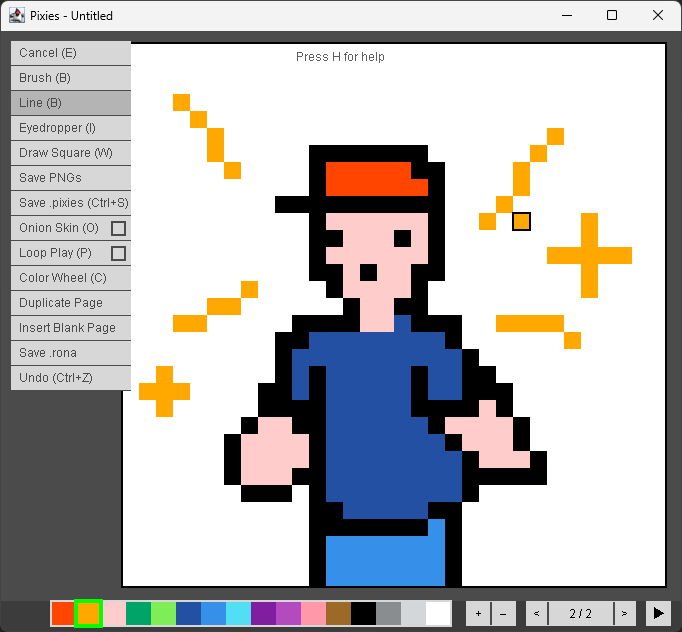
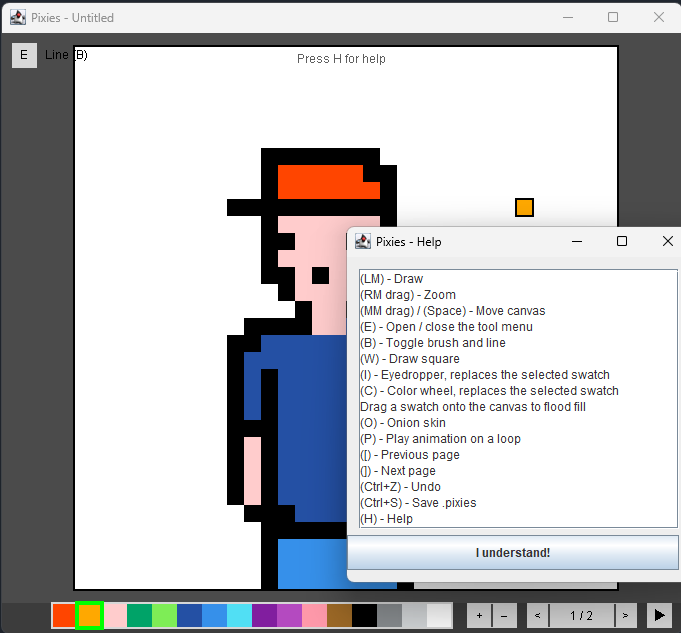

# Pixies

Pixies is a small pixel art and animation editor written in Java with Swing.

You draw on a square grid, flip between pages to build up an animation, preview it
on a loop with onion skinning, and then export the frames as PNGs or save the whole
thing to a single project file.



Everything you see is drawn by hand onto one `JPanel`. The canvas, the palette
strip, the tool menu and the page buttons are all painted directly and hit tested
by pixel coordinates, so there isn't a single Swing widget sitting on the drawing
surface.

## Requirements

Java 17 or newer. No libraries, no build tool, nothing to install.

## Running it

**In Eclipse**, import the folder as an existing project and run `Launcher`.

If you have edited any of the source files outside Eclipse, press <kbd>F5</kbd> on
the project and run **Project > Clean** before you run it. Otherwise Eclipse can
end up compiling new code against stale `.class` files left in `bin/`, which fails
in confusing ways.

**In a terminal:**

```bash
javac --release 17 -d bin *.java && java -cp bin Launcher
```

## Getting started

The main menu gives you two options.

**New file** lets you pick a name and a canvas size. You can choose 8, 16, 32, 64
or 128 pixels square, plus a 30px option that matches the `.rona` sample files.

**Open file** browses for an existing `.pixies` project.

Whatever name you type gets used for every file the editor writes, so any spaces
in it are stripped out.

## Controls

Press <kbd>H</kbd> at any point to get this list inside the app.



| Input | What it does |
| --- | --- |
| Left mouse | Draw |
| Right mouse drag | Zoom |
| Middle mouse drag, or <kbd>Space</kbd> and move | Pan the canvas |
| Drag a palette swatch onto the canvas | Flood fill |
| <kbd>E</kbd> | Open or close the tool menu |
| <kbd>B</kbd> | Switch between brush and line |
| <kbd>W</kbd> | Draw square |
| <kbd>I</kbd> | Eyedropper |
| <kbd>C</kbd> | Color wheel |
| <kbd>O</kbd> | Onion skin |
| <kbd>P</kbd> | Play the animation on a loop |
| <kbd>[</kbd> and <kbd>]</kbd> | Previous and next page |
| <kbd>Ctrl</kbd>+<kbd>Z</kbd> | Undo |
| <kbd>Ctrl</kbd>+<kbd>S</kbd> | Save `.pixies` |

Along the bottom bar you get the 16 colour swatches on the left, then **+** and
**-** to add and remove pages, then **< n / m >** to step between them, and finally
a play button that runs the animation through once.

One thing worth knowing: the eyedropper and the colour wheel both replace whichever
swatch is currently selected instead of adding a new one. The palette is always
exactly 16 colours.

## Undo

<kbd>Ctrl</kbd>+<kbd>Z</kbd> walks back through the last 64 edits. A full brush
stroke counts as a single step, so you don't have to undo it one pixel at a time.

It covers brush and line strokes, square fills, flood fills, adding, removing,
duplicating and inserting pages, the eyedropper and the colour wheel. There is no
redo yet.

## File formats

Everything gets written into the working directory using the project name, and if a
file of that name already exists it gets replaced without warning.

### `.pixies`

This is the project format, and the only one the editor can open again. It is plain
text with everything separated by whitespace:

```
<name> <pageCount> <canvasSize> <16 palette RGB triples> <RGB triple per pixel, per page>
```

Pixels are stored row by row, with all of page 0 first, then all of page 1, and so
on. Since the header is split on whitespace, the project name can't contain spaces.

### `.rona`

```
<name> <pageCount> <one digit per pixel, per page>
```

A `1` means a white pixel and a `0` means anything else. This one is export only.
The header doesn't record the canvas size or the palette, so the editor has no way
to read it back. `Icons.rona`, `Furniture.rona` and `Plant1.rona` are samples in
this format.

### PNG

**Save PNGs** writes one image per page, named `<name>0.png`, `<name>1.png` and so
on. Each one is scaled up 20x, so a single canvas pixel becomes a 20x20 block.

## What's in the project

| File | What it does |
| --- | --- |
| `Launcher.java` | Entry point, opens the main menu |
| `MainMenu.java` | Start screen for making or opening a file |
| `Renderer.java` | The editor window |
| `Panel.java` | The canvas, the UI, the painting and all the input handling |
| `Page.java` | A single animation frame, held as a flat array of colours |
| `UndoEntry.java` | One snapshot on the undo stack |
| `Saving.java` | The `.pixies`, `.rona` and PNG exporters |
| `ColorPicker.java` | The colour wheel window |
| `HelpPage.java` | The shortcut list |

The sources live in the project root rather than a `src` folder, because
`.classpath` sets the source folder to `""` and the output folder to `bin/`. That
is also why Eclipse copies the sample data files into `bin/` alongside the compiled
classes.

## Known limitations

* `.rona` files can be written but not opened.
* Saving always goes to the working directory and overwrites silently.
* There is no redo.
* The canvas size is set when you create the document and can't be changed later.
